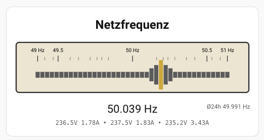

# reed-frequency-card

Analoges Reed Frequency Meter für Home Assistant zur Visualisierung der europäischen Netzfrequenz.




## Status

✅ Aktuelle Version: 0.4.3

---

## Beschreibung

Die **Reed Frequency Card** visualisiert die Netzfrequenz des europäischen Stromnetzes in Anlehnung an ein klassisches Reed Frequency Meter (Zungenfrequenzmesser).

Die Resonanz der 41 Frequenzzungen wird als SVG-Grafik dargestellt. Die aktuell angeregte Zunge wird abhängig von der gemessenen Netzfrequenz hervorgehoben. Zusätzlich wird die Frequenz digital mit drei Nachkommastellen angezeigt.

Die Skala ist für den Bereich 49 bis 51 Hz nichtlinear ausgeführt und bietet eine erhöhte Auflösung im Bereich um 50 Hz.

Optional können die Spannungen und Ströme aller drei Netzphasen eingeblendet werden.

Zusätzlich kann ein 24-Stunden-Mittelwert der Netzfrequenz als Referenzwert angezeigt werden.

---

## 24h Mittelwert der Netzfrequenz

Für die Anzeige des 24-Stunden-Mittelwertes wird ein Home-Assistant Statistik-Sensor verwendet.

Der Statistik-Sensor berechnet den linearen Durchschnitt der letzten 24 Stunden der Netzfrequenz.

### Statistik-Helfer anlegen

In Home Assistant:

**Einstellungen → Geräte & Dienste → Helfer → Helfer erstellen → Statistik**

Einstellungen:

| Einstellung | Wert |
| --- | --- |
| Name | Netzfrequenz Mittelwert 24h |
| Entität | Netzfrequenz API |
| Statistikmerkmal | Linearer Durchschnitt |
| Stichprobengröße | 28800 |
| Maximalalter | 24:00:00 |
| Letzten Messwert behalten | deaktiviert |
| Genauigkeit | 3 |

Dadurch entsteht die Entität:

```text
sensor.netzfrequenz_mittelwert_24h
```

Diese wird über `average_entity` in der Karte eingebunden.

Beispiel:

```yaml
average_entity: sensor.netzfrequenz_mittelwert_24h
show_average: true
```

---

## YAML

```yaml
type: custom:reed-frequency-card

title: Netzfrequenz

entity: sensor.netzfrequenz_api
average_entity: sensor.netzfrequenz_mittelwert_24h

show_average: true
show_version: false
show_phase_values: true
```

---

## YAML Optionen

| Option | Beschreibung | Standard |
| --- | --- | --- |
| entity | Frequenzsensor | erforderlich |
| title | Kartentitel | Netzfrequenz |
| average_entity | Sensor für den 24h Mittelwert | - |
| show_average | 24h Mittelwert anzeigen | true |
| show_version | Versionsnummer anzeigen | true |
| show_phase_values | Spannungs- und Stromwerte anzeigen | false |

---

## Funktionen

- Analoge Darstellung der Netzfrequenz
- 41 Frequenzzungen als SVG
- Digitale Frequenzanzeige mit drei Nachkommastellen
- Nichtlineare Frequenzskala mit erhöhter Auflösung um 50 Hz
- Anzeige des 24h Durchschnittswertes
- Vollständig über YAML konfigurierbar

---

## Changelog

siehe CHANGELOG.md
